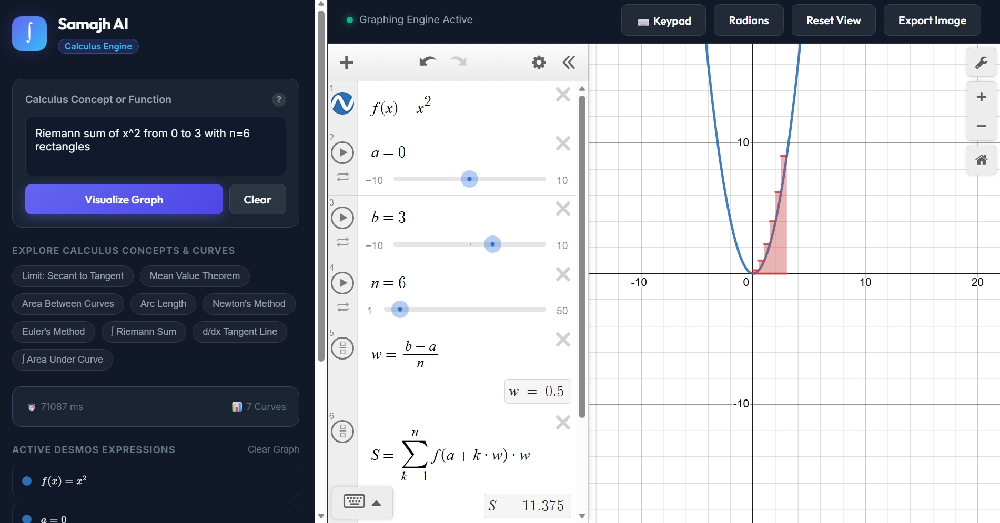
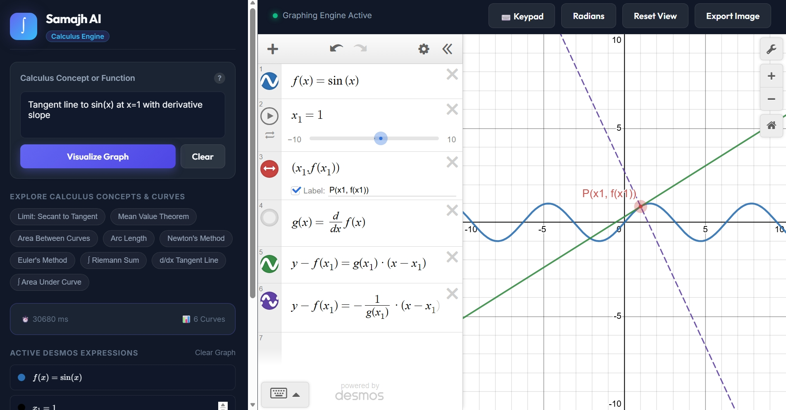
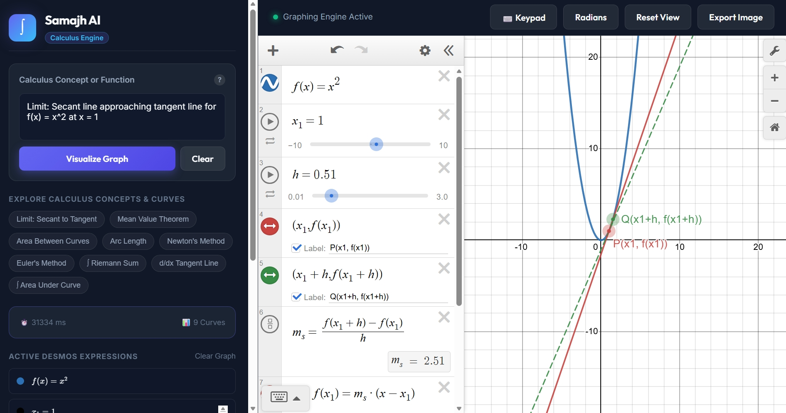
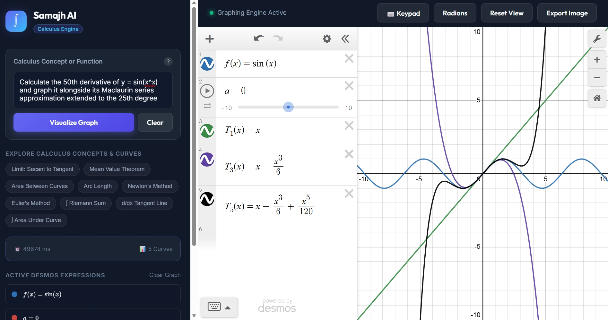

# Samajh AI Calculus Visualizer

> Samajh AI turns calculus questions and mathematical functions into interactive Desmos graphs. Enter a prompt such as “Riemann sum of x^2 from 0 to 3” or “tangent line to sin(x) at x=1”; the [...]

## Example Visualizations

A few sample outputs generated by the app:

### Reimann Sum

<p align="center">
  
</p>

### Tangent Line

<p align="center">
  
</p>

### Secant Line

<p align="center">
  
</p>

### Maclaurin Series

<p align="center">
  
</p>

## Features

- Interactive graphing with the Desmos Graphing Calculator.
- Streaming visualization updates using Server-Sent Events (SSE), with a non-streaming API fallback.
- Calculus concept and parameter extraction, with a local knowledge base of curated examples.
- Structured Gemini responses, validation, retry/fallback handling, and static examples when generation is unavailable.
- PostgreSQL-backed visualization logs, anonymous JWT sessions, and request rate limiting.

## Tech Stack

- **Frontend:** HTML, CSS, vanilla JavaScript, Desmos Graphing Calculator API, KaTeX.
- **Backend:** Python 3.11+, FastAPI, Uvicorn, Pydantic.
- **AI pipeline:** Google Gemini via `google-genai` and Instructor, with LangGraph orchestration and LangChain integrations.
- **Data and security:** PostgreSQL 16, SQLAlchemy asyncio, asyncpg, JWT, PostgreSQL row-level security, and rate limiting.
- **Development and deployment:** Docker and Docker Compose.

## Requirements

- Docker Desktop with Docker Compose (recommended), or Python 3.11+ for running the app locally.
- A Google Gemini API key for live AI generation. The app can fall back to rules-based and curated examples when Gemini is unavailable.
- A Desmos API key for the calculator integration.

## Configuration

Create a local environment file from the template:

```powershell
Copy-Item .env.example .env
```

Edit `.env` and set at least `GOOGLE_API_KEY` and `DESMOS_API_KEY`. The model defaults are:

```dotenv
GEMINI_PRIMARY_MODEL=gemini-3.8-flash
GEMINI_FALLBACK_MODEL=gemini-3.6-flash
```

You can override either model with an available Gemini model ID. Gemini API quotas depend on the Google AI project and model; changing models does not guarantee more quota. Check the project’s Gemin[...]

The template also contains PostgreSQL, JWT, and encryption settings. Compose supplies development defaults for these values. Replace the example credentials and secrets before deploying anywhere beyon[...]

## Run With Docker Compose

From the project root, with Docker Desktop running:

```powershell
Copy-Item .env.example .env
# Edit .env and add your API keys
docker compose up --build -d
```

Open [http://localhost:8000](http://localhost:8000). Check the service health at [http://localhost:8000/health](http://localhost:8000/health).

Useful commands:

```powershell
docker compose logs -f calculus-visualizer
docker compose restart calculus-visualizer
docker compose down
```

`docker compose down` keeps the named PostgreSQL volume. Avoid `docker compose down -v` unless you intend to delete the local database data.

## Run Locally With Python

This mode runs PostgreSQL in Docker and the FastAPI app in your Python virtual environment. If the Compose app is already running, stop only that service first because it uses port 8000:

```powershell
docker compose stop calculus-visualizer
docker compose up -d db
Copy-Item .env.example .env
# Edit .env and add your API keys
python -m venv venv
.\venv\Scripts\Activate.ps1
python -m pip install --upgrade pip
pip install -r requirements.txt
python run.py
```

The app starts at [http://localhost:8000](http://localhost:8000). To use a different port, set `PORT` before starting it:

```powershell
$env:PORT = '8001'
python run.py
```

On macOS or Linux, activate the environment with `source venv/bin/activate` instead of the PowerShell activation command. `run.py` loads variables from `.env` and starts Uvicorn with reload enabled.

## How It Works

1. The browser sends the prompt to the FastAPI visualization endpoint.
2. The backend sanitizes the input, checks that it is math-related, and extracts useful metadata such as functions and bounds.
3. The LangGraph pipeline retrieves a matching concept and Desmos templates, then asks Gemini for structured analysis and graph expressions when an API key is available.
4. The result is checked and normalized. If AI generation fails, the pipeline can use rules-based translation or a curated example from `backend/calculus_knowledge.json`.
5. The SSE endpoint sends metadata and expressions to the browser. The frontend applies each expression to Desmos in sequence, updating the expression list and graph as it goes.
6. Visualization requests and outcomes are logged to PostgreSQL.

## API Endpoints

- `GET /health` — service and dependency status.
- `GET /api/auth/session` — issue an anonymous session token.
- `GET /api/config` — return frontend configuration.
- `POST /api/visualize` — return a complete visualization response.
- `POST /api/visualize/stream` — stream visualization events using SSE. A `GET` variant is also supported.
- `GET /api/logs` — retrieve recent visualization logs for the current session.

The API documentation and OpenAPI schema are disabled in the application configuration.

## Tests

With the virtual environment activated and the database available, run:

```powershell
python -m pytest
```

## Project Layout

```text
backend/      FastAPI routes, AI pipeline, schemas, database, and calculus knowledge
frontend/     Single-page UI, styles, and Desmos/SSE client logic
postgres/     PostgreSQL initialization, TLS, and access configuration
security/     Authentication, rate limiting, input protection, and RLS helpers
tests/        API and pipeline tests
scratch/      Development and exploratory scripts
```
